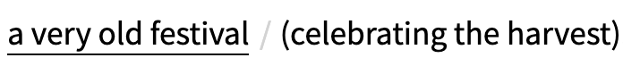
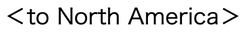
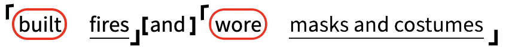

# Marking Method

Marking Method は、記号を英文につける読解法です。

## 記号一覧

| 記号 | 役割 | 例 |
|:---:|:---:|:---:|
| 二重線 | 主語 |  |
| 丸 | (助動詞) 動詞 |  |
| 一重線 | 目的語 / 補語 |  |
| 丸括弧 | 形容詞句・節 |  |
| 山括弧 | 副詞句・節 |  |
| 角括弧とかぎ括弧 | 等位接続詞と要素 |  |

## Demo 

[https://t-cool.github.io/marks (WIP)](https://t-cool.github.io/marks)

## ライセンス

MIT
